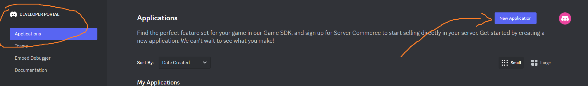
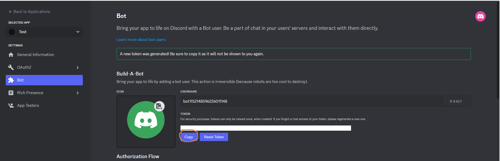
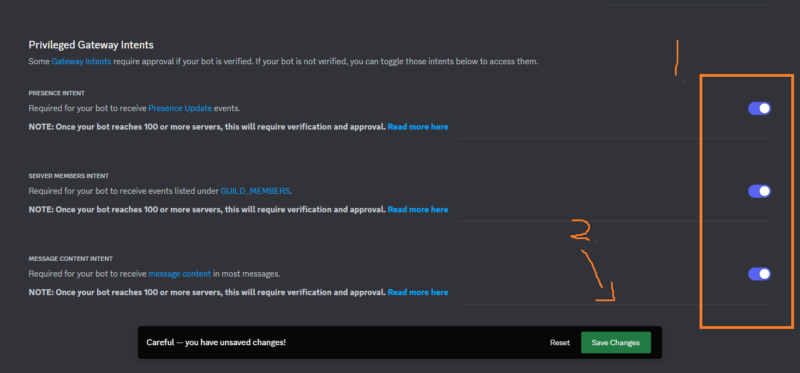
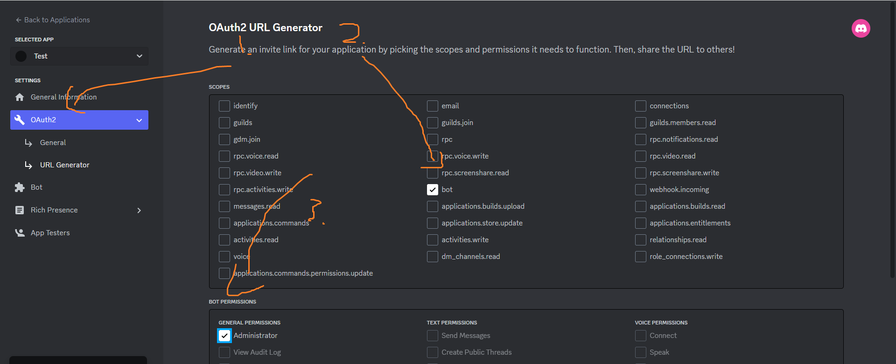
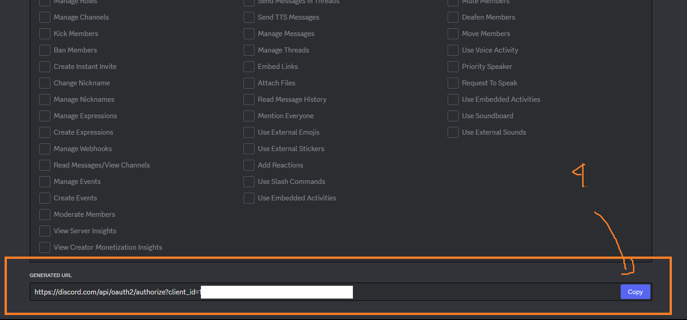
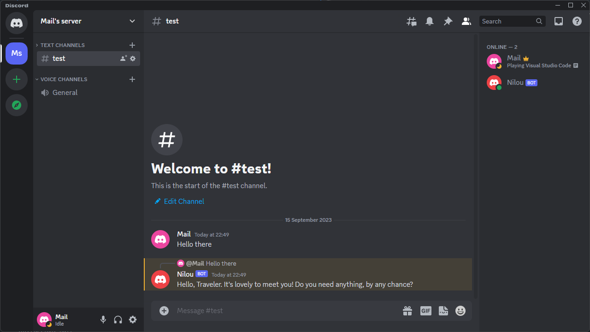
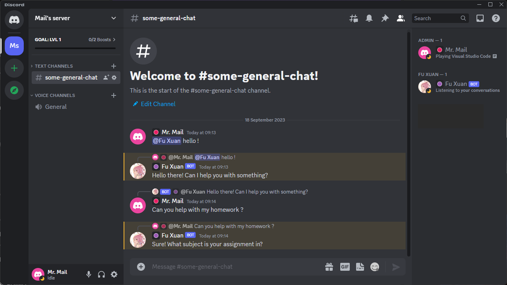
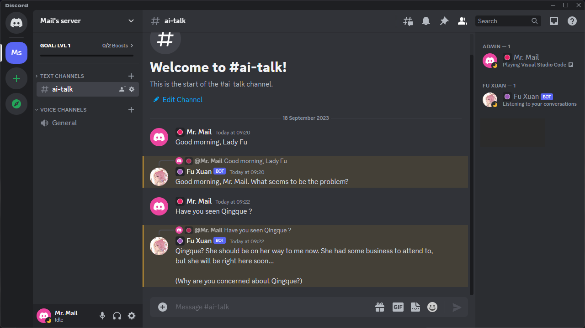
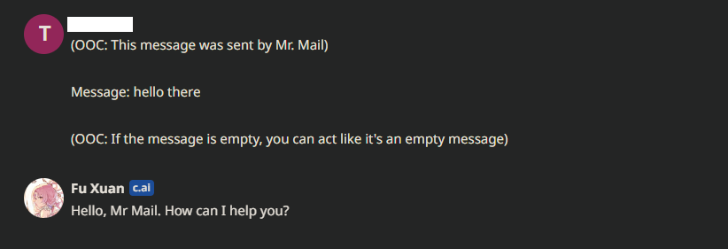
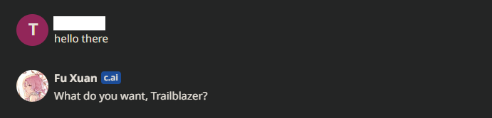

# Project Discontinued

## Discord AI ChatBot

Simple Ai Interactive Discord bot, using Character AI Unofficial API

## Requirements

- [node.js](https://nodejs.org/en/download) Latest LTS Version*
- Windows OS

*Recommended

## Getting Started

1. Create a Discord application <https://discord.com/developers/applications/>

    

2. Go to your application and copy your bot Token

    

3. Enable Privileged Gateway Intents

    

4. Head over to `Oauth2` -> `URL Generator`, and invite your bot to your server

    
    

5. You are done setting up the bot, up next : [Starting your bot](#starting-your-bot)

## Starting your bot

1. Clone or download this repository
2. Open terminal and type

    ```shell
    cp src/config-example.json src/config.json
    ```

3. Modify `config.json` with your configuration*
4. Now type in terminal, **make sure you have done [this step](#requirements)**

    ```shell
    npm install
    ```

5. After installation completed, run the bot

    ```shell
    npm run start
    ```

*Read [FAQ](#frequently-asked-question) for how to.

## Result



## Frequently asked question

Q : How do i get character.ai token ?

A : Please read [here](https://github.com/realcoloride/node_characterai#using-an-access-token).

Q : Where do i get character ID ?

A : You can find your character ID in the URL of a Character's chat page.

For example, if you go to the chat page of the character Test Character you will see the URL <https://beta.character.ai/chat?char=g7qgBp5ZSjzV8dWW8Fb_isU_plUWAecbLUiMDog_yRA>.

The last part of the URL is the character ID:
`g7qgBp5ZSjzV8dWW8Fb_isU_plUWAecbLUiMDog_yRA`

Q : How do i get Discord Channel ID ?

A : Head over to your `User Settings` -> `Advanced` and then toggle `Developer Mode` on. Now go back to your server, and right click the channel you want and copy the ID.

## Chat Mode

To change chat mode, modify your `config.json`. There are 3 modes: `mention`, `channel` and `hybrid`. See below for example:

1. Mention Mode
    

    In this mode, the bot will only reply if you mention the bot or reply to the bot. This mode usually used if you want the bot to reply in any channel*.

    *As i said earlier **The bot will only reply if you mention the bot or reply to the bot**.

2. Channel Mode
    

    In this mode, the bot will reply on specific channel. Make sure you set the `config.json`'s `chatMode` and change the `channelId` field to a correct channel id* where the bot have permission to `send message` and `read message` there.

    *If you don't know how to get a channel id, please click [here](#frequently-asked-question).

3. Hybrid Mode

    In this mode, the bot will reply either by mentioned, replied or in a specific channel. **Don't forget to set the channel id !**

4. Template

    Creates a template whenever the user send a message. You can enable this feature by setting `template` to `true` in `config.json`. And modify the template in `src/request.js` at line 12.

    - If enabled (`true`):
    

    - If disabled (`false`) :
    

    The Ai will see the message like this*

    *Do note that the message response will be different depends on the Ai Character's personality.

## Credits

- [node_characterai](https://github.com/realcoloride/node_characterai) - by [realcoloride](https://github.com/realcoloride)
